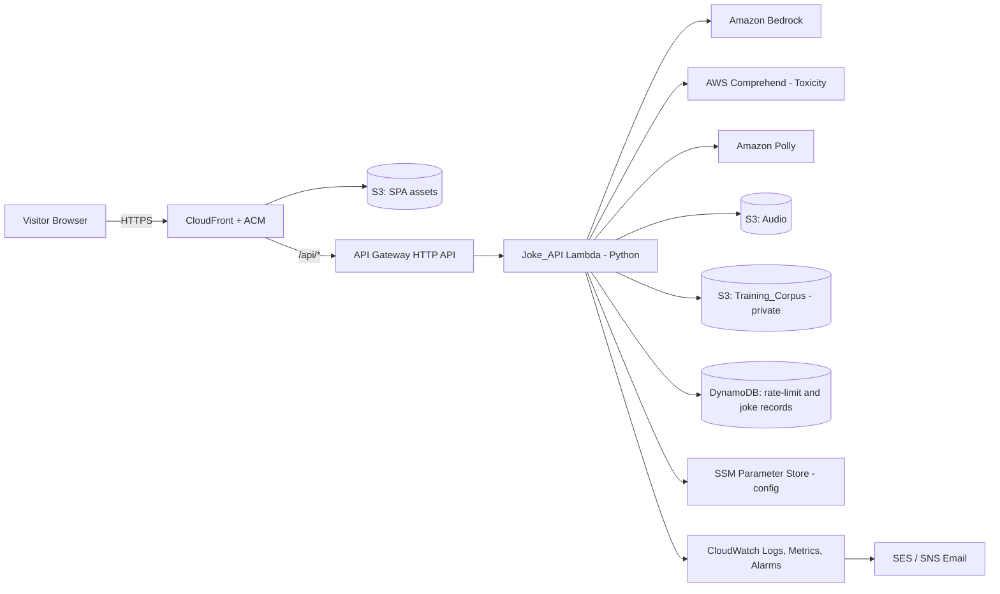
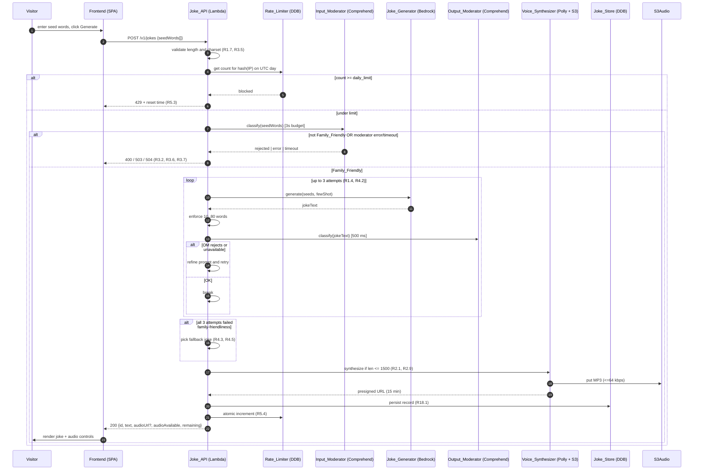
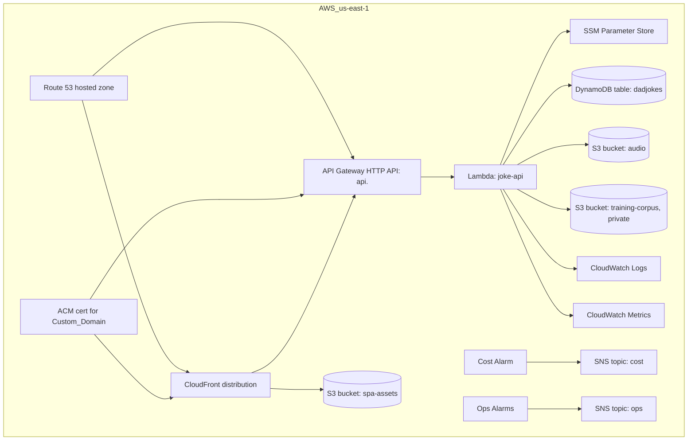

# Design Document

## Overview

The Dad Joke Generator is a public, anonymous web application that produces family-friendly (G/PG) dad jokes from optional seed words and returns them as both text and synthesized audio. The system is built as a static single-page Frontend served from Amazon CloudFront and a stateless Python backend (Joke_API) running on AWS Lambda behind Amazon API Gateway. Generation uses Amazon Bedrock; voice synthesis uses Amazon Polly; rate-limit counters and joke records are persisted in Amazon DynamoDB. Audio is stored in Amazon S3 and served via short-lived presigned URLs.

The design intentionally favors fully managed, pay-per-request AWS services to keep idle cost near zero and to make the system easy to operate from a single AWS account. All cross-cutting controls — input/output moderation, rate limiting, structured logging, IP hashing, and cost alarms — live in the backend Lambda so the static frontend cannot bypass them.

### Key Design Decisions

1. **Backend on Lambda + API Gateway (HTTP API)**: serverless, scales to zero, predictable per-request cost, native CloudWatch logs and metrics. Aligns with R5 (rate limit), R12 (production gate), R16 (observability).
2. **Python 3.12 backend with `boto3`**: matches Assumption A1 and gives mature Bedrock/Polly/Comprehend SDK coverage.
3. **DynamoDB single-table design** for `RateLimit` counters and `JokeRecord` history with TTL. Atomic counter updates satisfy R5.4. TTL satisfies R18.4.
4. **S3 for audio** with object expiration (30 days) and presigned GET URLs valid for 15 minutes (R2.4). Bucket is private, no public ACLs.
5. **CloudFront + ACM + Route 53** front the static SPA and the API Gateway custom domain (R6).
6. **Two-layer moderation**: a denylist filter plus an AWS Comprehend (or Bedrock Guardrails) classifier on both input and output; fail closed (R3.3, R3.6, R4).
7. **No fine-tuning in Phase 1**: Training_Corpus is loaded from a private S3 bucket and used as few-shot prompt examples only (R17, A3).
8. **Static SPA in S3 + CloudFront** rather than a server-rendered framework: cheapest hosting, easiest WCAG 2.1 AA conformance, simplest deploy.
9. **Configuration via AWS Systems Manager Parameter Store** for `daily_limit`, model id, voice id, ad-network id, ad feature flag — re-readable without redeploy (R5.7, R8.1, R8.4).

### Research Notes

- **Amazon Bedrock InvokeModel**: per-model `InvokeModel` and `Converse` APIs. `Converse` provides a uniform message schema across Anthropic, Amazon (Nova), Meta (Llama), and Mistral, simplifying the model swap required by R9.4. Source: AWS docs, *Amazon Bedrock User Guide → Converse API*.
- **Amazon Polly SynthesizeSpeech**: `OutputFormat=mp3`, `SampleRate=22050`, `VoiceId=<from config>`. Standard voices billed per million characters; Neural voices billed at a higher rate (R9.2). Polly synchronous synthesis has a 3,000-character input limit, well above our 1,500 cap (R2.9).
- **AWS Comprehend `DetectToxicContent`** (English): returns toxicity labels (PROFANITY, HATE_SPEECH, SEXUAL, VIOLENCE, INSULT, GRAPHIC, HARASSMENT_OR_ABUSE) with confidence scores. Suitable for the classifier role in R3.3 and R4.4. Alternative: Bedrock Guardrails policies.
- **DynamoDB `UpdateItem` with `ADD`** plus a conditional expression provides atomic counter increments required by R5.4.
- **API Gateway HTTP API + Lambda**: `requestContext.http.sourceIp` provides the proxy-resolved client IP; X-Forwarded-For can be parsed when CloudFront fronts the API (R5.8).
- **PlantUML rendering in CI**: official `plantuml/plantuml` Docker image renders `.puml` to PNG/SVG; rendering a small diagram completes in well under 120 s (R10.4).

## Architecture

### High-Level Component View



### Request Flow (Generate)



### Deployment View



These three diagrams (component, sequence, deployment) are the same three that R10.2 requires the Architecture_Document to maintain in PlantUML under `docs/architecture/`. The Mermaid versions here are reference renderings; the authoritative `.puml` sources live in the repository.

## Components and Interfaces

All component boundaries below correspond to Python modules in `src/joke_api/`. Each is a pure function or a thin wrapper over a single AWS client; this keeps the logic side testable without hitting AWS.

### Frontend (SPA)

- Single primary view: seed-word input (1–50 chars), Generate button, joke display area (<=1000 chars), audio controls (play/pause/replay), remaining-count badge, optional ad-banner slot.
- Built with vanilla TypeScript + a CSS framework that meets WCAG 2.1 AA contrast (R7.4). No SSR.
- Configuration (`config.json` shipped with build): API base URL, `adModuleEnabled` flag, `adNetworkId`. The flag is also exposed via a `/v1/config` endpoint so it can be flipped without redeploying the SPA (R8.1).
- Audio controls hidden when `audio_available=false` (R2.7). Generate button disabled when `remaining=0` (R7.8).

### Joke_API (Lambda handler)

Single Lambda with one HTTP endpoint per resource:

| Method | Path           | Purpose                                              |
|--------|----------------|------------------------------------------------------|
| POST   | `/v1/jokes`    | Generate a joke. Body: `{ "seedWords": ["..."] }`.   |
| GET    | `/v1/jokes/{id}` | Audit-style retrieval used by ops (R18.2).         |
| GET    | `/v1/config`   | Returns `{ adModuleEnabled, adNetworkId, dailyLimit }`. |
| GET    | `/v1/health`   | Production_Gate self-health probe (R12.2).           |

Internal pipeline (one function per stage, composed in `handler.py`):

1. `request_validator.validate(event)` — R1.7, R3.5, R5.9, R7.5.
2. `client_ip.resolve(event)` — leftmost X-Forwarded-For from trusted CloudFront/API GW (R5.8).
3. `rate_limiter.check(ip_hash)` — R5.2, R5.3.
4. `input_moderator.classify(seed_words)` — denylist + Comprehend (R3).
5. `joke_generator.generate(seed_words, few_shot)` — Bedrock Converse, retry up to 3× (R1.4, R4.2).
6. `output_moderator.classify(joke_text)` — Comprehend (R4.1, R4.4).
7. `voice_synthesizer.synthesize(joke_text)` — Polly + S3 presign, soft-fail (R2).
8. `joke_store.persist(record)` — soft-fail (R18.5).
9. `rate_limiter.increment(ip_hash)` — atomic, only on success (R5.4, R5.5).
10. `response_builder.build(...)` — sanitized errors only (R7.5, R7.6).

### Input_Moderator

```python
def classify(text: str) -> ModerationResult:
    # 1. Denylist substring match (case-insensitive, word-boundary aware).
    # 2. comprehend.detect_toxic_content(LanguageCode='en') with 3s timeout.
    # 3. flagged if either layer flags any segment.
```

- Returns `ModerationResult{ family_friendly: bool, reason: str|None, latency_ms: int }`.
- Raises `ModerationTimeout` if classifier exceeds 3 seconds (R3.7) and `ModerationUnavailable` on transport errors (R3.6).

### Output_Moderator

- Same classifier as above with a 500 ms hard budget (R4.1, R4.5).
- On unavailability or timeout, the caller short-circuits to the fallback list (R4.5).

### Joke_Generator

```python
def generate(
    seed_words: list[str],
    few_shot: list[str],
    *,
    refine: bool = False,
) -> str:
    """Bedrock Converse call. Returns joke text (no formatting)."""
```

- Builds the prompt: system message ("You are a corny but family-friendly dad-joke writer; G/PG only."), 3–10 few-shot examples from the Training_Corpus loader (R17.1), user message constructed from seed words.
- Calls `bedrock-runtime.converse` with the model id from SSM (R1.6).
- 15-second hard timeout per attempt (R1.5).
- Length guard: enforces 10–80 words; out-of-range responses count toward the 3-attempt budget (R1.4, R1.8).
- On `refine=True`, the system message appends explicit prohibitions for the categories listed in R4.2.

### Voice_Synthesizer

```python
def synthesize(joke_text: str) -> SynthesisResult:
    """Returns SynthesisResult{audio_url|None, audio_download_url|None,
    audio_available: bool, error: str|None}."""
```

- Skips Polly when `len(joke_text) > 1500` (R2.9).
- Calls `polly.synthesize_speech(OutputFormat='mp3', SampleRate='22050', VoiceId=<ssm>, Engine='standard', Text=joke_text)` (R2.2, R2.8).
- 10-second hard budget on synthesis (R2.6); writes MP3 to `s3://<audio-bucket>/<generation_id>.mp3`.
- Generates a 15-minute presigned GET URL for inline playback (R2.4).
- Generates a **second** 15-minute presigned GET URL for download (R2.10): identical object, but with `ResponseContentDisposition = attachment; filename="dad-joke-<id>.mp3"` so the browser saves the file with a friendly name instead of streaming it. This is surfaced as `audio_download_url` and mapped to the response's `audioDownloadUrl`. The download presign is a strictly weaker dependency than playback: if only the download presign fails, `audio_available` stays `true` and `audio_download_url` is `null`. The `GET /v1/jokes/{id}` audit path re-presigns both variants from the stored `s3://` reference via `voice_synthesizer.presign_audio_url(..., download_generation_id=...)`. Cross-origin note: the presigned S3 URL is a different origin than the SPA, so the HTML `download` attribute alone would be ignored — the server-side `Content-Disposition` header is what actually forces the download. The frontend download control (R2.11) is hidden whenever `audioDownloadUrl` is `null`.

### Rate_Limiter

```python
def check(ip_hash: str, day: str, limit: int) -> int:
    """Returns current count; raises RateLimitExceeded if count >= limit."""

def increment(ip_hash: str, day: str) -> int:
    """UpdateItem ADD #count :one (atomic). Returns new count."""
```

- Storage: DynamoDB partition key `pk = "RL#" + ip_hash`, sort key `sk = "DAY#" + utc_date_string`.
- TTL set to "next UTC midnight + 1 minute"; satisfies R5.6 (DynamoDB TTL deletes within 48 hours, but we additionally treat any record from a prior `utc_date_string` as zero on read, giving immediate logical reset at the boundary).
- Configurable `daily_limit` from SSM Parameter Store, validated to 5–10 inclusive (R5.7).

### Joke_Store

- DynamoDB items: `pk = "JOKE#" + generation_id`, `sk = "META"`, attributes per Data Models below.
- TTL attribute `expires_at` set to `created_at + 90 days` (R18.4).
- Validation: rejects items whose `joke_text` exceeds 2000 chars or `audio_ref` exceeds 2048 chars (R18.6).

### Ad_Module (Frontend)

- Reads `adModuleEnabled` from `/v1/config`. If false: do not render the slot, do not reserve layout space, do not load any third-party script (R8.3).
- If true: lazy-load exactly one ad-network script for the configured `adNetworkId`, with a 3-second timer; on timeout/error the slot remains empty (R8.4–R8.6). No CSP entries for any other ad domain.

### Configuration (SSM Parameter Store)

| Parameter                           | Type      | Default                  | Requirement |
|-------------------------------------|-----------|--------------------------|-------------|
| `/dadjokes/daily_limit`             | Integer   | 5 (range 5–10)           | R5.7        |
| `/dadjokes/bedrock_model_id`        | String    | per Cost_Report          | R1.6, R9.4  |
| `/dadjokes/polly_voice_id`          | String    | standard voice           | R2.8, R9.4  |
| `/dadjokes/ad_module_enabled`       | Boolean   | false                    | R8.1        |
| `/dadjokes/ad_network_id`           | String    | empty                    | R8.4        |
| `/dadjokes/ip_hash_salt`            | SecureStr | 32+ bytes random         | R16.7       |
| `/dadjokes/cost_alarm_threshold_usd`| Number    | 10.00 (range 1.00–10000) | R16.3       |

## Data Models

### Request: `POST /v1/jokes`

```json
{
  "seedWords": ["pickle", "engineer"]
}
```

- `seedWords`: optional array, 0–5 entries; each entry 1–30 chars; allowed chars `[A-Za-z0-9'-]` (R1.2, R1.7).
- Aggregate text length 0–100 chars after joining (R3.4, R3.5).

### Response: `200 OK`

```json
{
  "id": "f7a2...-uuid-v4",
  "text": "Why did the pickle become an engineer? It had a lot of dill-igence.",
  "audioUrl": "https://<audio-bucket>.s3.amazonaws.com/...?X-Amz-Signature=...",
  "audioAvailable": true,
  "remaining": 4,
  "modelId": "anthropic.claude-3-haiku-...",
  "voiceId": "Joanna"
}
```

- `audioUrl` omitted (or null) when `audioAvailable=false` (R2.7, R7.8).

### Error Responses (sanitized; technical detail goes to logs only — R7.5, R7.6)

| Status | When                                                  | Body                                                                 |
|--------|-------------------------------------------------------|----------------------------------------------------------------------|
| 400    | Validation failure on seed words or length            | `{"error":"validation","rule":"seed_word_charset","message":"..."}` |
| 400    | Input moderation rejection                            | `{"error":"moderation","message":"Input must be G or PG rated."}`    |
| 429    | Rate limit reached                                    | `{"error":"rate_limited","resetAtUtc":"YYYY-MM-DDT00:00:00Z"}`       |
| 503    | Bedrock unavailable / 3 attempts failed length        | `{"error":"unavailable","message":"Service temporarily unavailable."}`|
| 503    | Input moderator unreachable                           | `{"error":"moderation_unavailable"}`                                 |
| 504    | Input moderator timeout (>3 s)                        | `{"error":"moderation_timeout"}`                                     |

### DynamoDB: `dadjokes` (single table)

| Attribute    | Type | Notes                                                          |
|--------------|------|----------------------------------------------------------------|
| `pk`         | S    | `RL#<ip_hash>` or `JOKE#<uuid>`                                |
| `sk`         | S    | `DAY#<YYYY-MM-DD>` for rate-limit; `META` for joke records     |
| `count`      | N    | Rate-limit counter                                             |
| `joke_text`  | S    | <=2000 chars (R18.6)                                           |
| `audio_ref`  | S    | <=2048 chars; e.g., `s3://audio/<id>.mp3` (R18.6)              |
| `model_id`   | S    | <=128 chars                                                    |
| `voice_id`   | S    | <=128 chars                                                    |
| `created_at` | S    | ISO 8601 UTC                                                   |
| `expires_at` | N    | TTL epoch seconds (`created_at + 90d` for jokes; next UTC midnight + 60 s for rate-limit) |

### S3 Buckets

- **`spa-assets`** (CloudFront origin): SPA static files. Public read via CloudFront OAC only.
- **`audio`**: MP3 outputs. `Block Public Access = ALL`. Lifecycle rule deletes after 30 days. Presigned GET URLs only.
- **`training-corpus`**: private corpus. `Block Public Access = ALL`. Read access granted only to the Lambda execution role (R17.2). No public links and no presigned URLs returned to clients (R17.3).

### Structured Log Record (R16.1)

```json
{
  "request_id": "uuid-v4",
  "ip_hash": "sha256-hex-of-saltedIP",
  "decision": "accepted|moderation_rejected|rate_limited|error",
  "model_id": "string",
  "voice_id": "string",
  "latency_ms": 1234,
  "estimated_cost_usd": 0.000123,
  "ts": "2025-01-01T00:00:00Z"
}
```

- Emitted to CloudWatch Logs within 2 s of request completion.
- Source IPs are never logged raw; only the salted SHA-256 hash is recorded (R16.7).


## Correctness Properties

*A property is a characteristic or behavior that should hold true across all valid executions of a system — essentially, a formal statement about what the system should do. Properties serve as the bridge between human-readable specifications and machine-verifiable correctness guarantees.*

The properties below are universally quantified statements derived from the prework analysis of every acceptance criterion. Each property will be implemented as a single property-based test running at least 100 iterations. Acceptance criteria classified during prework as `EXAMPLE`, `EDGE_CASE`, `INTEGRATION`, or `SMOKE` are not listed here; their tests are described in the Testing Strategy section.

### Property 1: Seed-word containment when seeds are supplied

*For any* valid seed-word list (1–5 entries, each 1–30 chars matching `[A-Za-z0-9'-]`), the joke text returned by `POST /v1/jokes` SHALL contain at least one of the supplied seed words as a case-insensitive substring, OR the response SHALL be HTTP 503 after exactly 3 attempts.

**Validates: Requirements 1.2, 1.4, 1.8**

### Property 2: Joke length is within 10..80 words inclusive

*For any* sequence of mock Bedrock outputs, the handler SHALL return joke text only when its word count is in `[10, 80]`; otherwise the handler SHALL return HTTP 503, and the total number of Bedrock attempts SHALL never exceed 3.

**Validates: Requirements 1.4, 1.8**

### Property 3: Bedrock failure produces 503 with no partial content

*For any* Bedrock failure mode (transport error, exception, or response exceeding the 15-second budget), the handler SHALL return HTTP 503 and the response body SHALL NOT contain any joke text or audio reference.

**Validates: Requirements 1.5**

### Property 4: Generation IDs are unique UUID v4s

*For any* sequence of successful generation requests, every returned generation identifier SHALL be a syntactically valid UUID v4 and no two responses in the sequence SHALL share an identifier.

**Validates: Requirements 1.3, 18.1**

### Property 5: Input validation rejection short-circuits the pipeline

*For any* request whose seed-word input violates a rule (more than 5 entries, any entry exceeding 30 chars, any entry containing characters outside `[A-Za-z0-9'-]`, or aggregate length exceeding 100 chars), the handler SHALL return HTTP 400 identifying the violated rule, and SHALL NOT invoke the Input_Moderator, Bedrock, Polly, or the Rate_Limiter increment.

**Validates: Requirements 1.7, 3.4, 3.5**

### Property 6: Audio availability mirrors Polly outcome

*For any* Polly outcome (success, transient error, timeout, or skipped because joke text length is outside `[1, 1500]`), the response SHALL contain joke text, the `audioAvailable` boolean SHALL be `true` iff Polly succeeded, and `audioUrl` SHALL be present iff `audioAvailable` is `true`.

**Validates: Requirements 2.1, 2.3, 2.6, 2.7, 2.9**

### Property 7: Presigned audio URLs are valid for at least 15 minutes

*For any* generation that produced audio, the presigned GET URL returned to the client SHALL have an `X-Amz-Expires` value greater than or equal to 900 seconds.

**Validates: Requirements 2.4**

### Property 8: Moderation gate precedes Bedrock for all accepted inputs

*For any* request that results in a Bedrock invocation, the Input_Moderator SHALL have been invoked first and SHALL have returned a `family_friendly = true` classification, AND the request SHALL have passed length/charset validation.

**Validates: Requirements 3.1, 3.2**

### Property 9: Family-friendliness is the logical OR of denylist and classifier flags

*For any* input text, `Input_Moderator.classify(text).family_friendly` SHALL equal `not (denylist_match(text) or classifier_flag(text))`.

**Validates: Requirements 3.3**

### Property 10: Moderator unavailability fails closed

*For any* Input_Moderator failure mode (transport error, exception, or response exceeding the 3-second budget), the handler SHALL return HTTP 503 (transport/exception) or HTTP 504 (timeout) and SHALL NOT invoke Bedrock or increment the rate-limit counter.

**Validates: Requirements 3.6, 3.7**

### Property 11: Output moderator and Input moderator are equivalent

*For any* text, `Output_Moderator.classify(text)` SHALL produce the same `family_friendly` decision as `Input_Moderator.classify(text)`.

**Validates: Requirements 4.4**

### Property 12: Output rejection retries up to three attempts with refined prompts

*For any* sequence of Output_Moderator decisions on generated jokes, the total number of Bedrock attempts SHALL be at most 3, and on attempts 2 and 3 the prompt SHALL include the explicit category prohibitions defined in R4.2.

**Validates: Requirements 4.2**

### Property 13: All-rejected outputs fall back to a curated safe joke

*For any* sequence of three Output_Moderator decisions where every decision is `not_family_friendly` (or the moderator is unavailable on every attempt), the response text SHALL be drawn from `FALLBACK_JOKES`, where `len(FALLBACK_JOKES) >= 20`, and a moderation-failure log entry containing timestamp, attempt count, and rejection category SHALL be recorded.

**Validates: Requirements 4.3, 4.5**

### Property 14: Rate-limit counters increment atomically and only on success

*For any* concurrency level `N` of successful generation requests originating from the same source IP within a single UTC day, after all requests complete the recorded daily counter for that IP SHALL equal `N`. *For any* failed request (validation, moderation, Bedrock error, Polly error, persistence error, or any other failure), the counter SHALL be unchanged.

**Validates: Requirements 5.4, 5.5**

### Property 15: Limit-reached requests are rejected with HTTP 429

*For any* `(current_count, daily_limit)` pair where `current_count >= daily_limit`, the handler SHALL return HTTP 429 with a body containing `resetAtUtc` set to the next 00:00:00 UTC boundary, and SHALL NOT invoke the Input_Moderator, Bedrock, or Polly.

**Validates: Requirements 5.3**

### Property 16: Counters reset across UTC-day boundaries

*For any* prior-day count `c_y` and any request occurring on the following UTC day, the rate-limit lookup for that request SHALL return `0` regardless of `c_y`.

**Validates: Requirements 5.6**

### Property 17: Daily_Limit configuration is bounded

*For any* configured `daily_limit` value, configuration loading SHALL accept it iff it is an integer in `[5, 10]`; values outside this range SHALL be rejected at startup, and accepted values SHALL be applied without code change.

**Validates: Requirements 5.7**

### Property 18: Forwarded-For resolution uses the leftmost address

*For any* `X-Forwarded-For` header value composed of one or more comma-separated IP addresses with arbitrary surrounding whitespace, the resolved client IP SHALL equal the trimmed leftmost address; *for any* request with a missing, empty, or malformed header (when XFF is required), the handler SHALL return an error response and SHALL NOT increment any counter.

**Validates: Requirements 5.8, 5.9**

### Property 19: HTTP requests redirect to HTTPS preserving path and query

*For any* request to the Custom_Domain over plain HTTP with path `P` and query string `Q`, the response SHALL be HTTP 301 with `Location: https://<custom_domain>P?Q` (with `?Q` omitted when `Q` is empty).

**Validates: Requirements 6.3**

### Property 20: Error responses are sanitized and logged in full

*For any* error path (validation, moderation, rate limit, Bedrock failure, Polly failure, persistence failure, or unexpected exception), the response body SHALL contain only an error category and a human-readable suggested next action, SHALL NOT contain stack traces, file paths, AWS resource ARNs, AWS account ids, or other internal identifiers, AND a corresponding log record containing the full technical detail SHALL be emitted within 5 seconds of the error.

**Validates: Requirements 7.5, 7.6**

### Property 21: Generate button state mirrors remaining count

*For any* response, the Frontend's Generate button SHALL be disabled iff `remaining == 0`, and a daily-limit-reached message naming the next reset time SHALL be displayed iff `remaining == 0`.

**Validates: Requirements 7.8**

### Property 22: Ad_Module rendering and network access are flag-gated

*For any* configured value of the `adModuleEnabled` flag, the Frontend SHALL render an ad slot iff the flag is `true`, SHALL reserve no layout space when the flag is `false`, AND when the flag is `true` the captured network requests' hostnames SHALL be a subset of `{configured_ad_network_domain}`.

**Validates: Requirements 8.1, 8.3, 8.4**

### Property 23: Plan/Test-Plan freshness check on src/ changes

*For any* `(now_utc, plan_last_modified_utc, test_plan_last_modified_utc)` triple where a pull request modifies any file under `src/`, the Build_Pipeline check SHALL fail iff `floor((now - plan_last_modified) / 1 day) > 90` OR `floor((now - test_plan_last_modified) / 1 day) > 90`.

**Validates: Requirements 11.6**

### Property 24: Plan/Test-Plan cross-reference completeness

*For any* parsed `(PLAN.md, TEST_PLAN.md)` pair, the Production_Gate cross-reference check SHALL pass iff every requirement identifier listed in `PLAN.md` appears at least once in `TEST_PLAN.md`.

**Validates: Requirements 12.5**

### Property 25: Cost_Report ↔ runtime configuration consistency

*For any* `(cost_report_model_id, runtime_model_id, cost_report_voice_id, runtime_voice_id)` tuple, the Production_Gate consistency check SHALL block deployment iff `cost_report_model_id != runtime_model_id` OR `cost_report_voice_id != runtime_voice_id`.

**Validates: Requirements 12.6**

### Property 26: Feature branch name validator

*For any* candidate Git branch name, the validator SHALL accept iff the name matches the regex `^feature/[a-z0-9-]{3,50}$`.

**Validates: Requirements 13.2**

### Property 27: Each requirement assigned to exactly one phase

*For any* parsed `PLAN.md` document, the phase-assignment check SHALL pass iff every requirement identifier appears in exactly one of the three phase sections.

**Validates: Requirements 14.2**

### Property 28: Phase scope rule for deployments

*For any* `(current_phase, requirement_phase)` pair where phases are ordered Phase 1 < Phase 2 < Phase 3, deployment SHALL be allowed iff `requirement_phase <= current_phase`.

**Validates: Requirements 14.3**

### Property 29: Manual-setup completion requires an ISO 8601 date

*For any* edit to `PLAN.md` that sets a manual-setup item's checkbox to checked, the validator SHALL accept iff the same edit records a completion date matching `^\d{4}-\d{2}-\d{2}$` and representing a valid calendar date.

**Validates: Requirements 15.4, 15.5**

### Property 30: Per-request structured log schema

*For any* request handled by the Joke_API, the captured log records SHALL contain exactly one record with fields `request_id` (UUID v4), `ip_hash` (64-char lowercase hex), `decision` ∈ `{accepted, moderation_rejected, rate_limited, error}`, `model_id`, `voice_id`, `latency_ms` (integer in `[0, 60000]`), and `estimated_cost_usd` (decimal in `[0.000000, 1.000000]`), emitted within 2 s of request completion.

**Validates: Requirements 16.1**

### Property 31: Cost-alert email subject and gating

*For any* CloudWatch alarm-state-change event, the cost-alert email SHALL be sent iff the new state is `ALARM` (and the previous state was not `ALARM`), the subject SHALL contain the literal token `[COST-ALERT]` and the breached threshold value formatted as USD, and the email SHALL be sent on the cost SNS topic only.

**Validates: Requirements 16.4**

### Property 32: Cost-email retry caps at three attempts

*For any* sequence of email-delivery outcomes for a single cost alarm, the total number of delivery attempts SHALL be at most 4 (1 initial + up to 3 retries) with successive attempts spaced 60 seconds apart, and each attempt outcome SHALL be recorded in the structured log.

**Validates: Requirements 16.5**

### Property 33: Ops-alert email subject, channel, and trigger thresholds

*For any* operational metric stream, an ops-alert email SHALL be sent iff a configured threshold is breached (moderation rejections > 50 in any 5-minute window, rate-limit rejections > 100 in any 5-minute window, or Bedrock/Polly errors > 10 in any 5-minute window), the subject SHALL contain `[OPS-ALERT]` and SHALL NOT contain the token `cost`, and the email SHALL be sent on the ops SNS topic.

**Validates: Requirements 16.6**

### Property 34: IP addresses are never logged in raw form

*For any* source IP `ip` and any request, every log record and every persisted attribute SHALL contain only `sha256_hex(salt || ip)` where `salt` is at least 32 bytes; no captured log line, persisted attribute, metric dimension, or response body SHALL contain `ip` as a substring.

**Validates: Requirements 16.7**

### Property 35: Observability emission failures are soft-failures

*For any* failure to emit a structured log record or a CloudWatch metric, the originating request SHALL still complete with its normal response, the internal observability-failure counter SHALL be incremented exactly once per failure, and the failure SHALL NOT be reflected in the visitor-facing response body.

**Validates: Requirements 16.8**

### Property 36: Few-shot prompt construction respects size bounds

*For any* `Training_Corpus` content, the few-shot prompt builder SHALL return between 3 and 10 examples, each example SHALL be at most 500 characters in length, and the joined few-shot section SHALL be at most 5000 characters.

**Validates: Requirements 17.1**

### Property 37: Training_Corpus contents never reach clients

*For any* `POST /v1/jokes` response and *for any* request targeting a corpus path, the response body SHALL NOT contain any `Training_Corpus` object key, presigned corpus URL, or corpus file content; corpus-targeted requests SHALL return an authorization error.

**Validates: Requirements 17.2, 17.3**

### Property 38: Binary corpus assets never reach Bedrock

*For any* `Training_Corpus` item that is a video or image file, the prompt sent to Bedrock SHALL contain at most a textual extract of length ≤ 500 characters and SHALL NOT contain raw binary bytes from the source file; if extraction fails for an item, that item SHALL be excluded from the few-shot pool and an extraction-failure indication SHALL be recorded.

**Validates: Requirements 17.4, 17.5**

### Property 39: Rights-flag gates corpus inclusion

*For any* generation invocation, when the rights-confirmation flag in `PLAN.md` is `false`, the prompt's few-shot section SHALL be empty.

**Validates: Requirements 17.7**

### Property 40: Joke persistence round-trip is byte-exact

*For any* successful generation `(id, text, audio_ref, model_id, voice_id, created_at)` returned to the visitor, `JokeStore.get(id)` SHALL return a record whose `text` and `audio_ref` are byte-for-byte identical to the values returned, and whose `model_id`, `voice_id`, and `created_at` match the original record.

**Validates: Requirements 18.1, 18.2**

### Property 41: Unknown ids do not mutate the store

*For any* identifier not present in the `Joke_Store`, `get(id)` SHALL return a not-found indication, and a snapshot of all stored records taken before and after the call SHALL be equal.

**Validates: Requirements 18.3**

### Property 42: TTL retention rule is enforced by `expires_at`

*For any* persisted record with `created_at = c`, the record's `expires_at` attribute SHALL equal `c + 90 days` expressed as epoch seconds, and a record with `created_at` older than 90 days from `now` SHALL not be returned by `get`.

**Validates: Requirements 18.4**

### Property 43: Persistence failures do not affect the visitor response

*For any* `Joke_Store` write failure, the visitor SHALL still receive a 200 response with the joke text and audio reference, a persistence-failure log entry containing the generation identifier, failure reason, and timestamp SHALL be recorded, and the visitor-facing response body SHALL NOT contain any indication of the persistence failure.

**Validates: Requirements 18.5**

### Property 44: Persistence input-size validation

*For any* `(joke_text, audio_ref)` pair, `JokeStore.persist` SHALL accept the record iff `len(joke_text) ≤ 2000` and `len(audio_ref) ≤ 2048`; rejected records SHALL emit a validation-failure log entry naming the offending field and the generation identifier, AND a snapshot of all existing records taken before and after the rejected call SHALL be equal.

**Validates: Requirements 18.6**

### Property 45: Audio download URL carries an attachment disposition

*For any* generation that produced audio, the response SHALL contain a download URL distinct from the playback URL, that download URL's presign SHALL set `ResponseContentDisposition` to `attachment; filename="dad-joke-<id>.mp3"`, and its `X-Amz-Expires` value SHALL be greater than or equal to 900 seconds. WHERE the playback presign succeeds but the download presign fails, `audio_available` SHALL remain `true`, the playback URL SHALL be present, and the download URL SHALL be `null` (graceful degradation). WHERE `audio_available` is `false`, both the playback URL and the download URL SHALL be `null`.

**Validates: Requirements 2.10, 2.11**

## Error Handling

### Categories and visitor-facing responses

| Category               | HTTP | Visitor message (sanitized)                                                | Internal log detail |
|------------------------|------|-----------------------------------------------------------------------------|---------------------|
| Validation             | 400  | "Input must be 1–5 words, each up to 30 characters, letters/digits/`'-`."   | violated rule, field name, raw input length only (never raw input) |
| Input moderation       | 400  | "Input must be G or PG rated."                                              | which layer flagged (denylist or classifier), category label |
| Moderator unavailable  | 503  | "Service temporarily unavailable, please try again."                        | upstream exception class + message |
| Moderator timeout      | 504  | "Service is taking longer than expected. Please try again."                 | elapsed ms, last partial response |
| Rate limit             | 429  | "You've reached the daily limit. Counters reset at 00:00 UTC."              | ip_hash, current_count, daily_limit |
| Bedrock error          | 503  | "Service temporarily unavailable, please try again."                        | exception class, attempt number |
| Bedrock length failure | 503  | "Service temporarily unavailable, please try again."                        | last 3 word counts |
| Polly failure          | 200  | text returned with `audioAvailable=false` and `error: "audio_unavailable"` | Polly exception class, char count |
| Persistence failure    | 200  | normal response                                                             | persistence-failure log entry per R18.5 |
| Unexpected exception   | 500  | "An unexpected error occurred. Please try again."                           | full stack trace + request_id |

### Cross-cutting rules

- **Sanitization (R7.5)**: a single `response_builder.sanitize_error(category, message)` function is the only path that builds error response bodies. It accepts only an enumerated category plus a static human-readable message and never accepts free-form internal text. A regression test asserts that no error response body contains stack-trace markers (`Traceback`, `at `, `.py:`), `arn:aws:`, or AWS account IDs.
- **Fail-closed (R3.6, R3.7)**: when the Input_Moderator cannot be reached or times out, the handler returns 503/504 and never invokes Bedrock. The Rate_Limiter increment is never executed on failed requests (R5.5).
- **Fail-soft (R2.6, R18.5)**: Polly synthesis and Joke_Store persistence both fail soft so the visitor still receives joke text. Both emit structured failure log records.
- **Retry budgets**: Bedrock generation has 3 attempts total across length-rejection (R1.4, R1.8) and output-moderation rejection (R4.2), counted against a single shared budget; refined prompt is applied on attempts 2 and 3.
- **Concurrency safety**: rate-limit counters use DynamoDB `UpdateItem` with `ADD #count :one`, which is atomic regardless of concurrent invocations (R5.4). The increment runs only after every other stage of the request has succeeded (R5.5).
- **Telemetry on failure**: every error path produces a structured log record per R16.1 within 2 s and increments the relevant CloudWatch counter (`moderation_rejections`, `rate_limit_rejections`, or generic `errors`).

## Testing Strategy

### Approach

Two complementary layers, plus selective integration and visual tests:

- **Unit tests** (Python `pytest`): specific examples, edge cases, error conditions. Mocks for `boto3` clients via `moto` (DynamoDB, S3, SSM) and a hand-rolled in-memory fake for Bedrock, Polly, and Comprehend.
- **Property-based tests** (`hypothesis`): one property-based test per Correctness Property listed above, configured with `@settings(max_examples=100)` (minimum). Bedrock, Polly, and Comprehend are replaced by deterministic fakes whose behavior is parameterized by Hypothesis strategies, so 100 iterations are cheap.
- **Frontend component tests** (`vitest` + `@testing-library/dom`): renders the SPA against a mocked API and asserts visible elements, controls, and disabled/enabled states.
- **Accessibility tests** (`axe-core` via `@axe-core/playwright`): automated WCAG 2.1 AA audit of the built SPA on representative viewports (R7.4).
- **Visual regression** (`playwright` snapshot): SPA at 320, 768, 1280, 1920 px viewports for R7.3.
- **Integration tests** (`pytest` + `boto3` against an ephemeral stack deployed by CI): end-to-end joke generation against real Bedrock/Polly/Comprehend in a sandbox account; small fixed input set covering R6 (TLS, redirect), R10 (PlantUML render), R11 (PLAN/TEST_PLAN logging), R12 (production gate), R13 (project-board automation), R16 (alarm pipeline).
- **Smoke tests** (CI assertions on configuration): SSM parameter values, ACM cert SANs, DynamoDB table TTL config, S3 bucket public-access blocks (R6.2, R10.1, R10.2, R17.2).

### Property-based testing — library and configuration

- **Language**: Python 3.12.
- **Library**: [`hypothesis`](https://hypothesis.readthedocs.io/) — mature, well-maintained, idiomatic for Python. We do **not** implement property-based testing from scratch.
- **Frontend properties** (e.g., Property 21, Property 22) are implemented in TypeScript using [`fast-check`](https://fast-check.dev/) with `vitest`.
- **Iterations**: `@settings(max_examples=100, deadline=None)` for every property-based test (or `fc.assert(prop, { numRuns: 100 })` in `fast-check`). Properties touching DynamoDB use `moto`; properties touching S3 use `moto` for the Joke_Store and a fake presigner for Property 7.
- **Tagging**: every property test docstring carries the tag `Feature: dad-joke-generator, Property {n}: {property_text}` so the design ↔ test mapping is greppable. A CI script validates that every property number 1..45 is covered by exactly one test.

### Test structure (mapping properties to test files)

```
tests/
  unit/                        # example + edge-case tests
    test_request_validator.py
    test_response_builder.py
    test_fallback_jokes.py     # asserts FALLBACK_JOKES has >= 20 entries
    test_polly_args.py         # R2.2, R2.8 args check
  property/                    # one file per requirement cluster
    test_validation_property.py        # P5
    test_generation_property.py        # P1, P2, P3, P4
    test_audio_property.py             # P6, P7
    test_moderation_property.py        # P8, P9, P10, P11, P12, P13
    test_rate_limit_property.py        # P14, P15, P16, P17, P18
    test_redirect_property.py          # P19
    test_error_sanitization_property.py # P20
    test_frontend_state_property.ts    # P21, P22 (fast-check)
    test_governance_property.py        # P23, P24, P25, P26, P27, P28, P29
    test_observability_property.py     # P30, P31, P32, P33, P34, P35
    test_corpus_property.py            # P36, P37, P38, P39
    test_persistence_property.py       # P40, P41, P42, P43, P44
  integration/
    test_https_integration.py          # R6
    test_plantuml_render.py            # R10.4–10.6
    test_pipeline_gate.py              # R11, R12
    test_e2e_generate.py               # one happy-path against deployed stack
  smoke/
    test_config_present.py             # SSM, ACM, S3 BPA, DDB TTL
```

### Coverage targets (to be recorded in `docs/TEST_PLAN.md` per R11.2)

| Test type        | Target                                  | Pass criterion                                     |
|------------------|------------------------------------------|----------------------------------------------------|
| Unit             | line 80 % / branch 70 %                  | All unit tests green; coverage thresholds enforced |
| Property         | every property 1..44 implemented         | Each property test runs ≥ 100 examples and passes  |
| Integration      | R6, R10–R13, R16, R18 covered            | All integration tests green in CI sandbox          |
| Accessibility    | 0 axe violations at WCAG 2.1 AA          | Zero `serious` or `critical` violations            |
| Performance      | p95 < 10 s end-to-end (R1.3)             | Load test of 50 RPS for 5 min meets p95 threshold  |

### Why some requirements are NOT covered by property-based tests

The Testing Strategy intentionally omits PBT for:

- **Infrastructure as Code (R6, R10, parts of R12)**: TLS, DNS, CloudFront, and PlantUML rendering are configuration / pipeline behavior. Snapshot tests of synthesized templates and integration tests against a sandbox cover these.
- **UI rendering and layout (parts of R7, R8.2, R8.5)**: visual rules use snapshot/visual-regression tests.
- **Process and documentation (R9, R11.1–11.5, R13.1, R13.4–13.5, R14.1, R14.4, R15.1–15.3, R15.6, R17.6, R17.8)**: these are content checks, board configurations, or process steps verified by CI scripts that lint Markdown/YAML structure.
- **One-shot infrastructure assertions (R2.2, R2.8, R6.2)**: smoke tests on configured values; running 100 iterations adds no signal.
- **Performance latency (R1.3 p95)**: performance/load test, not PBT.

### Review and Approval

After updating this design document the user reviews it; on approval the workflow proceeds to tasks. If gaps are identified, the workflow returns to requirements clarification before re-entering design.
